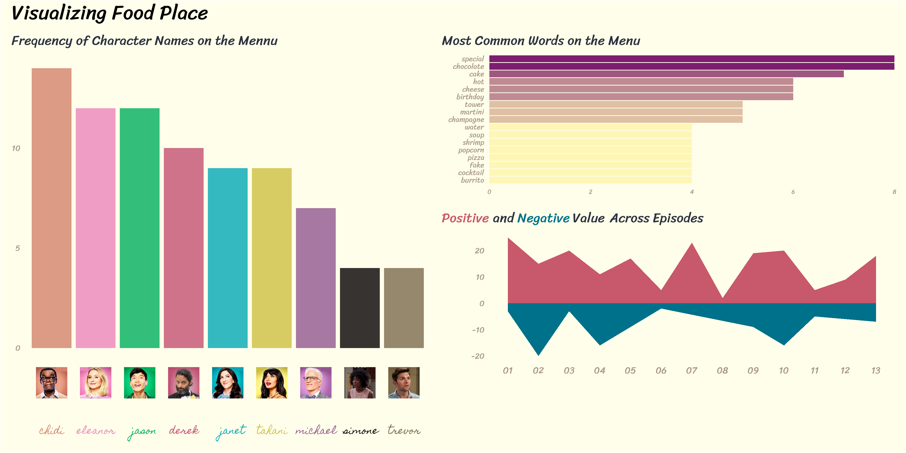

```{r, echo = FALSE}
knitr::opts_chunk$set(message = FALSE, warning = FALSE)
```

# Food place

Inspired by https://github.com/mine-cetinkaya-rundel/the-food-place  

```{r}
library(tidyverse)
library(tidytext)
library(glue)
library(rvest)
library(patchwork)
library(ggtext)
library(ggpomological)

library(showtext)
font_add_google("Homemade Apple", "apple")
font_add_google("Sriracha")
showtext_auto()
```


## Scraping  


```{r, cache = TRUE}
url <- "https://thefoodplace.cafe/"
page_source <- read_html(url)
```


```{r}
nodes <- page_source %>% 
  html_nodes("#cake .menu-item , #bottomless .menu-item , #theselection .menu-item , #brunch .menu-item , #soups .menu-item , .menu-item+ .menu-item , #entrees .menu-item , .menu-item:nth-child(1)")

food_names <- nodes %>% 
  html_node(".name") %>% 
  html_text()

food_episodes <- nodes %>%
  html_node(".episode") %>% 
  html_text()

food_descriptions <- nodes %>% 
  html_node(".description") %>%
  html_text() %>% 
  str_trim(side = "both")
```


```{r}
food_place <- tibble(
  name = food_names,
  description = food_descriptions,
  season_episode = food_episodes,
) %>% 
  separate(season_episode, into = c("season", "episode"), sep = "\\.")

food_place
```

## pre

```{r}
character <- c(
  "chidi",   
  "eleanor",
  "jason",
  "derek",
  "janet",
  "tahani",
  "michael",
  "simone",
  "trevor"
)

mean_img_color <- function(x) {
  data <- png::readPNG(x)
  color_freq <- names(sort(table(rgb(data[,,1], data[,,2], data[,,3])), 
                           decreasing = TRUE))
  setdiff(color_freq, c("#FFFFFF", "#000000", "#010101"))[1] # with janet fix
}
```


```{r}
# characters <- tibble(
#   character = character,
#   src = glue("images/food_place/{character}.png"),
#   color = map_chr(src, mean_img_color),
#   labels = glue(" <br><span style = 'color: {color}'>{character}</span>")
# )

characters <- pins::pin_get("food_place_characters")
```


```{r}
name_words <- food_place %>% 
  unnest_tokens(word, name) %>% 
  anti_join(stop_words) %>% 
  mutate(word = str_replace(word, "’s", "")) %>% 
  count(word, sort = TRUE) %>% 
  mutate(type = if_else(word %in% character, "character", "food"))
```

## Character plot  

```{r, cache = TRUE}
character_words <- name_words %>%
  filter(type == "character") %>%
  left_join(characters, by = c("word" = "character")) %>%
  mutate(word = str_to_title(word))

character_plot <- character_words %>%
  ggplot(aes(x = fct_reorder(word, n, .desc = TRUE), y = n, fill = color)) +
  geom_col(alpha = 0.8) + 
  scale_fill_identity() +
  scale_x_discrete(name = NULL, labels = characters$labels) +
  theme_minimal() + 
  theme_pomological(base_family = "apple") + 
  theme(
    plot.title = element_text(size = 40, face = "bold", family = "Sriracha"),
    plot.title.position = "plot",
    axis.text.x = element_markdown(lineheight = 1.2, size = 28),
    axis.title.y = element_blank(),
    axis.text.y = element_text(size = 24, family = "Sriracha"),
    panel.grid.minor   = element_blank(),
    panel.grid.major.x = element_blank(),
    panel.border = element_blank(),
    ) +
  labs(
    title = "Frequency of Character Names on the Mennu")

ggsave("plots/food_place_characters.png", character_plot,
       width = 8, height = 5)
```

## Food plot  

```{r}
food_words <- name_words %>% 
  filter(type == "food") %>% 
  top_n(15, wt = n)

food_plot <- food_words %>% 
  ggplot() + 
  geom_col(aes(fct_reorder(word, n), n, fill = n)) + 
  scale_fill_gradient(low = "#fef6b5", high = "#7c1d6f") + 
  scale_y_continuous(expand = c(0, 0)) + 
  coord_flip() + 
  theme_pomological(base_family = "Sriracha") + 
  theme(plot.title.position = "plot",
        plot.title = element_text(size = 40),
        axis.text.y = element_text(face = "bold", size = 22),
        axis.text.x = element_text(size = 18),
        panel.border = element_blank(),
        legend.position = "none") + 
  labs(title = "Most Common Words on the Menu",
       x = "",
       y = "")

ggsave("plots/food_place_words.png", food_plot, width = 8, height = 5)
```


## Description analysis   


```{r}
description_sentiment <- food_place %>% 
  unnest_tokens(word, description) %>% 
  anti_join(stop_words) %>%
  inner_join(get_sentiments()) %>%
  mutate(sent_type = if_else(value > 0, "postive", "negative")) %>%
  group_by(episode, sent_type) %>% 
  count(wt = value)


sentiment_plot <- description_sentiment %>% 
  ggplot() + 
  geom_area(aes(episode, n, fill = sent_type, group = sent_type)) +
  scale_fill_manual(values = c("#00718b", "#c8586c")) + 
  theme_minimal() + 
  theme_pomological(base_family = "Sriracha") + 
  theme(
        plot.title = element_markdown(size = 40),
        plot.title.position = "plot",
        panel.grid = element_blank(), 
        panel.border = element_blank(),
        axis.text.x = element_text(size = 28),
        axis.text.y = element_text(size = 24),
        axis.title.x = element_blank(),
        axis.title.y = element_blank(),
        legend.position = "none"
        ) + 
  labs(title = "<span style = 'color: #c8586c'>Positive</span> and <span style = 'color: #00718b'>Negative</span> Value Across Episodes")

ggsave("plots/food_place_sentiment.png", sentiment_plot, width = 8, height = 6)
```

## Final plot  

```{r}

final_plot <- character_plot + food_plot / sentiment_plot + 
  plot_annotation(
    title = "Visualizing Food Place",
    theme = theme(plot.title = element_text(family = "Sriracha", size = 60),
                  plot.title.position = "plot",
                  plot.background = element_rect(fill = "#fffeea")))

ggsave("plots/food_place_final.png", width = 12, height = 6,
       dev = "png", type = "cairo")
```


```{r, echo = FALsE}

```


